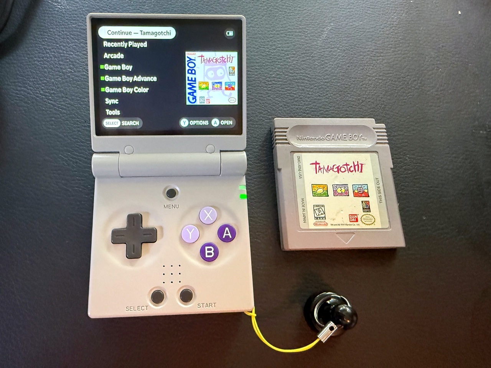
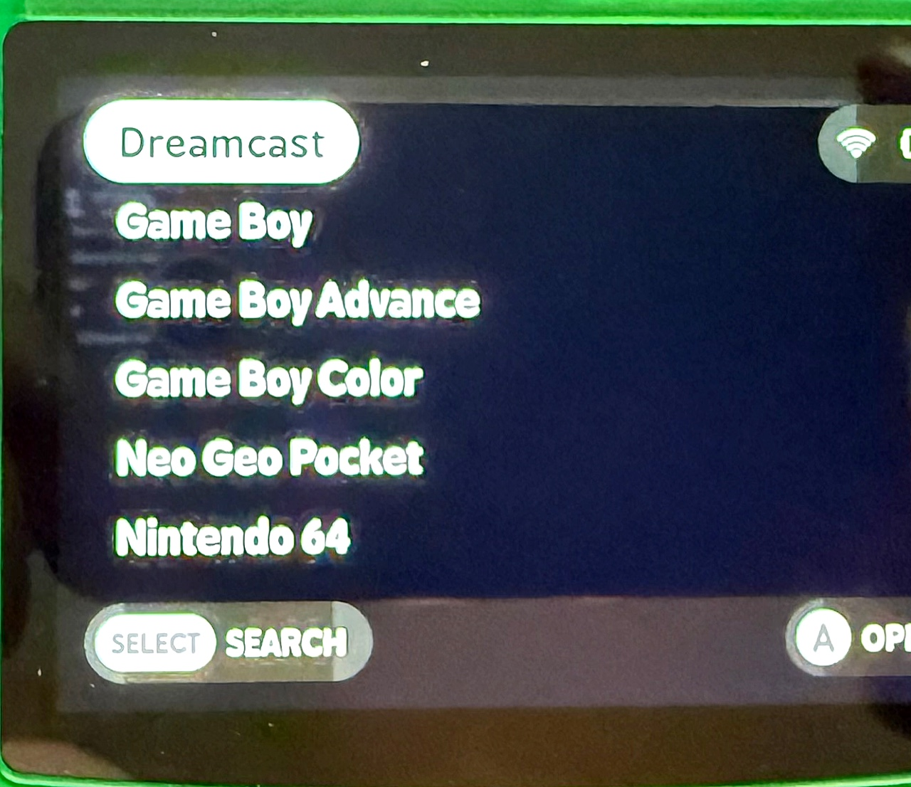
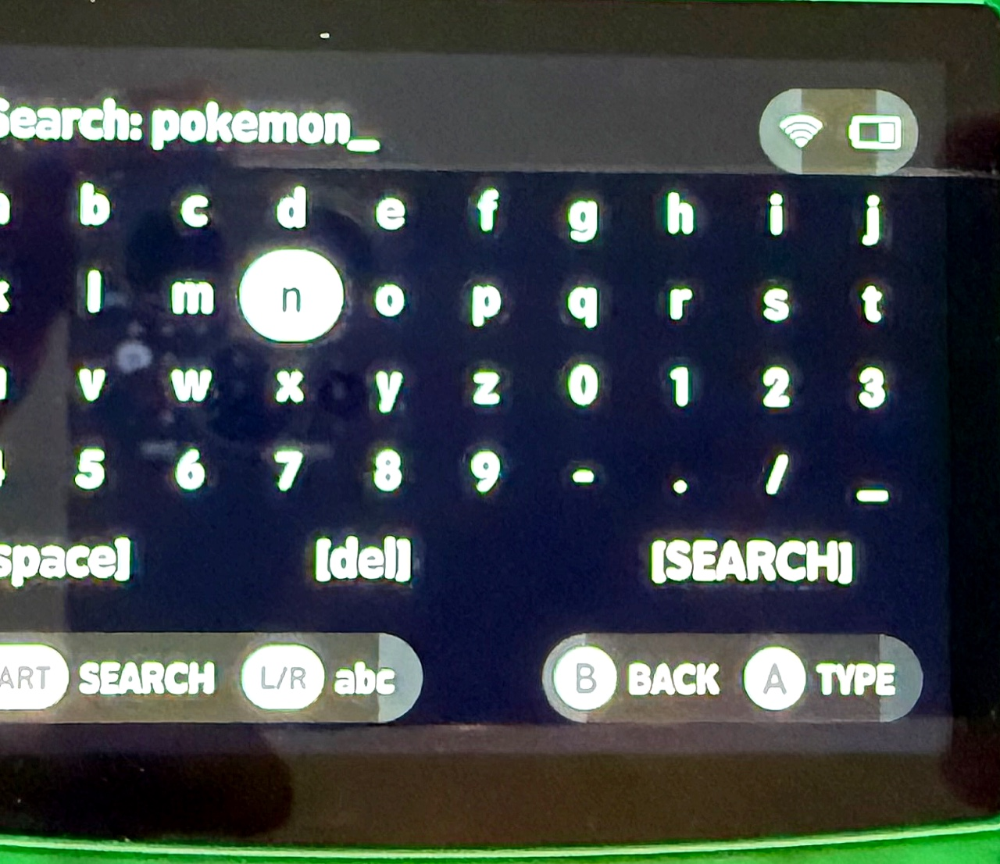
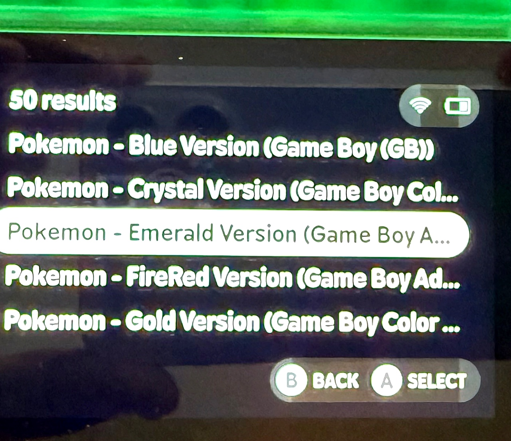
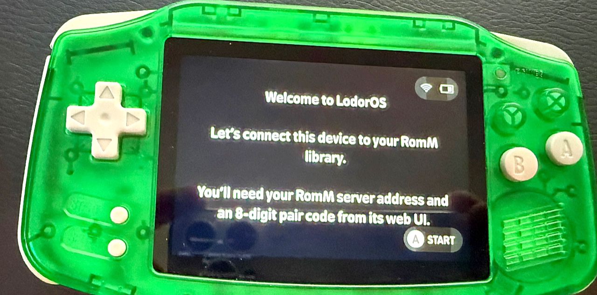
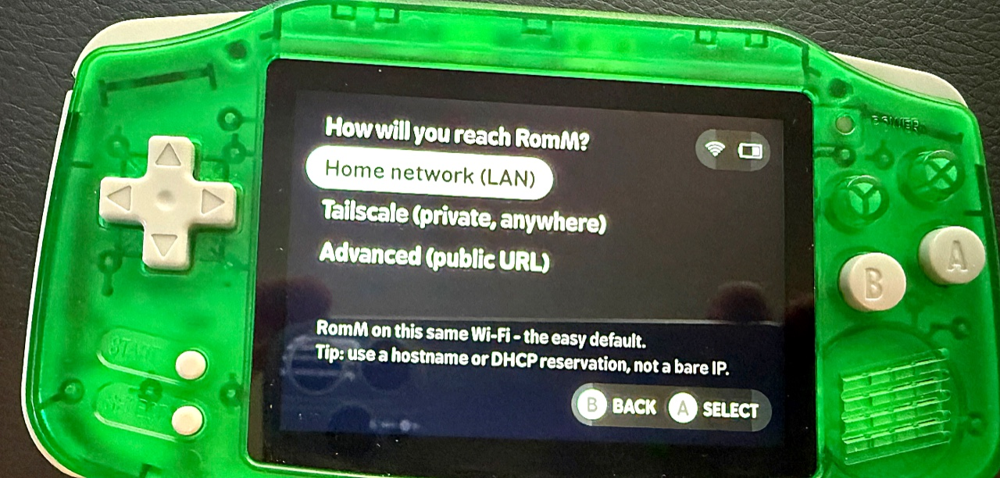
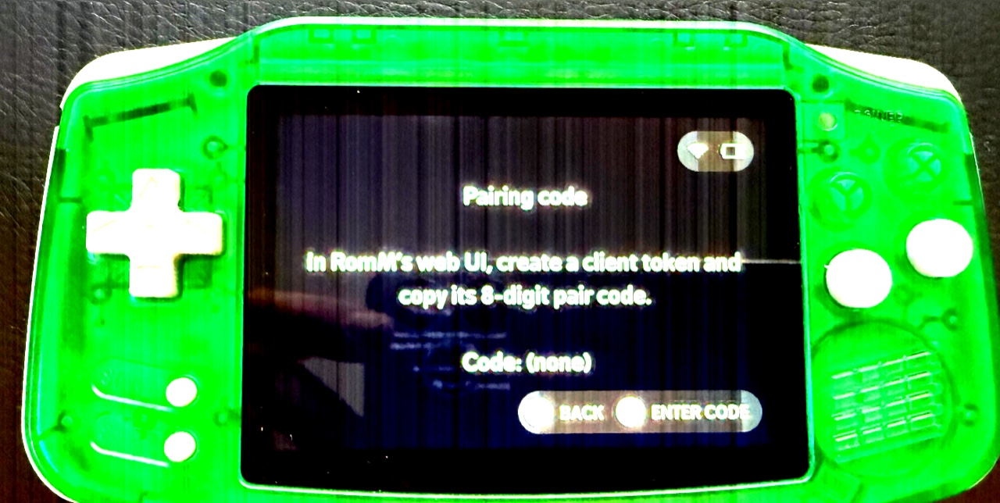

# LodorOS

  

**Your self-hosted [RomM](https://romm.app) library, on your handheld.** LodorOS is a [MinUI](https://github.com/shauninman/MinUI) fork that turns a cheap retro handheld into a thin client for your own RomM game-library server: your whole collection shows up in the menu as lightweight stubs with box art, games download on demand, and saves sync both ways — automatically, around every play session. Wi-Fi-dark by default; **your library is never exposed to the open internet.**

> **Beta.** LodorOS is a *client for your own RomM server* — not a plug-and-play "download games" OS. If you run (or want to run) RomM, this is for you.

## Download & docs
- ⬇️ **Releases:** https://github.com/lodordev/lodoros/releases
- 📖 **Wiki / setup guide:** https://github.com/lodordev/lodoros/wiki

## Features
- **Whole-library browsing, offline** — every game in RomM appears in the menu with box art, even with Wi-Fi off.
- **Download-on-launch** — pick a game you don't have on the card; it downloads, hash-verifies, and boots.
- **Two-way save sync** — saves pull before you play and push after you quit, to RomM. Restore older saves from the server.
- **Private access** — reach your server over **Tailscale** or **Cloudflare Access** (service token), or plain **LAN**. RomM stays off the public internet.
- **One download, whole fleet** — the same release boots every supported device.
- Keeps MinUI's clean, fast, native look.

## Supported devices
Miyoo Mini Plus · Miyoo A30 · Miyoo Flip V2 · Anbernic H700 family (RG35XX Plus / H, RG34XX, RG28XX, RGcubeXX, RG40XX) · Powkiddy RGB30.
TrimUI devices are served separately by the no-fork **Lodor-NextUI** tool.

## Requirements
A self-hosted **RomM** server + a supported device. **BYOB** — LodorOS never ships BIOS/firmware; supply your own for systems that need them.

## Screenshots

  
  
  

  
  
  

---

## For developers

This repository is the single source of truth for LodorOS and its companion integrations. It's structured so a change in one component can't silently break another before it reaches hardware.

### Layout
| Dir | What |
|---|---|
| `engine/` | The LodorOS sync core (Go, CGO-free static; `armhf` + `arm64` cover every device). |
| `lodoros/` | The forked MinUI launcher (C) and its paks — the native-menu LodorOS. |
| `integrations/nextui/` | No-fork TrimUI/NextUI Tool-pak (shell) that drives the same engine. |
| `integrations/` | Other no-fork host integrations (muOS, OnionOS). |
| `contract/` | `config.schema.json` — the single definition of `config.json`, shared by the Go and C readers. |
| `release/` | `release.sh` (build every platform from one commit), `gate.sh` (pre-flash checks). |

### Build & release principles
- **One release, all platforms.** `release.sh <commit>` builds every platform from one pinned commit and aborts on any missing or ungated artifact — no "works on one device, not another" from divergent source.
- **Gate before flash.** `gate.sh` runs static ELF checks (interpreter/NEEDED/glibc-floor + required symbols) and a redistributability check, so a wrong-libc brick or a non-free/secret-bearing artifact never reaches a card.
- **Config contract.** Any change to `contract/config.schema.json` bumps `schema_version` and updates every reader in the same commit; the contract gate runs first.

### Building
The engine is CGO-free Go (`GOARCH=arm GOARM=7` for armhf, `arm64` otherwise). The launcher builds per-platform against each device's toolchain. See `release/` for the pipeline.

## License
LodorOS's original code — the paks, the onboarding flow, and the sync engine — is released by **lodordev under the [MIT License](LICENSE)**. LodorOS is a fork of [MinUI](https://github.com/shauninman/MinUI), used and modified **with the author's permission**; files derived from MinUI (notably the launcher) remain subject to MinUI's terms and their original author's copyright. See [`LICENSE`](LICENSE) for the full statement.

## Credits
Built on **MinUI** (Shaun Inman). Save-sync lineage credits **[Grout](https://github.com/rommapp/grout)**. The H700 heavy-emulator approach credits **[ryanmsartor](https://github.com/ryanmsartor/RGXX-Custom-MinUI-Paks)**. Thanks to **RomM**, **Tailscale**, **Cloudflare**, and the retro-handheld community. See the wiki's [Credits](https://github.com/lodordev/lodoros/wiki/Credits) for the full list.
